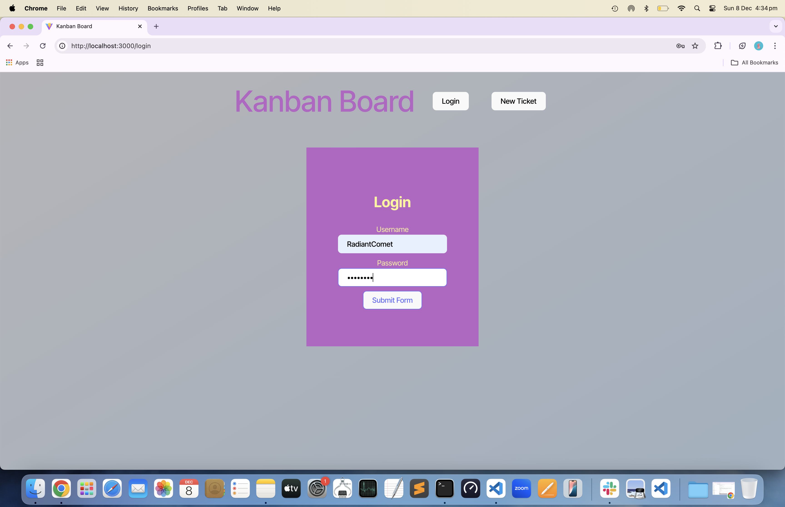

# kanban-board

Add authentication with JSON Web Token to an existing Kanban Board application.

## Table of Contents

- [Description](#description)
- [Installation](#installation)
- [Usage](#usage)
- [License](#license)
- [Contributing Guidelines](#contributing-guidelines)
- [Testing](#testing)
- [Authors and Acknowledgements](#authors-and-acknowledgements)


## Description

A full stack single page app of a Kanabn Board created with React + Vite + Typescript + Sequelise + JSON Web Token.

## Installation

1. Clone the repository

```zsh

git clone git@github.com:gina-t/kanban-board.git

```

2. There are 3 separate package.json to manage dependencies: Root, Client, and Server.

3. Root package.json

```zsh

npm install --save-dev concurrently eslint-config-prettier nodemon prettier typescript wait-on

```
4. Server package.json

```zsh

cd server
npm install cors dotenv express sequelize pg jsonwebtoken bcrypt
npm install --save-dev @types/cors @types/bcrypt

```

5. Client package.json

```zsh

cd client
npm install jwt-decode react react-dom react-router-dom 
npm install --save-dev @types/react @types/react-dom @typescript-eslint @vitejs/plugin-react eslint eslint-plugin-react-hooks eslint-plugin-react-refresh typescript vite

```

6. Create the schema and users/tickets tables for kanban-db

```zsh

CREATE DATABASE kanban_db;

-- Connect to the newly created database
\c kanban_db

-- Create the users table
CREATE TABLE users (
    id SERIAL PRIMARY KEY,
    username VARCHAR(255) NOT NULL UNIQUE,
    password VARCHAR(255) NOT NULL,
    created_at TIMESTAMPTZ DEFAULT NOW(),
    updated_at TIMESTAMPTZ DEFAULT NOW()
);

-- Create the tickets table
CREATE TABLE tickets (
    id SERIAL PRIMARY KEY,
    name VARCHAR(255) NOT NULL,
    status VARCHAR(255) NOT NULL,
    description VARCHAR(255) NOT NULL,
    assigned_user_id INTEGER REFERENCES users(id),
    created_at TIMESTAMPTZ DEFAULT NOW(),
    updated_at TIMESTAMPTZ DEFAULT NOW()
);

```

7. Download PostgreSQL from https://www.postgresql.org/download/ for your OS and generate a password

8. Open a PostgreSQL interactive terminal and connect to kanban_db:

```zsh

psql -h localhost -U postgres -d kanban_db
\i server/db/schema.sql

```

9. In server directory run the seed script:

```zsh

npm run seed

```

10. Create and initialise kanban_db using psql and Sequelize

11. Generate a secure random string to use as JWT secret key and store in .env file. In root directory:

```zsh

node -e "console.log(require('crypto').randomBytes(64).toString('hex'))"

```
11. In root run concurrently server:dev and client:dev:

```zsh

npm run start:dev

```
12. In root build the app:

```zsh

npm run build

```
13.Render Configuration

Build command: npm run render-build

Start command: npm start


## Usage

Link to Render deployment and screenshots of app demonstarting functionality:

[](https://kanban-board.onrender.com)

### screenshot-1


### screenshot-2


### screenshot-3


## License

[](https://opensource.org/licenses/MIT)

## Contributing Guidelines

Create a new branch for the commit and start a pull request.

## Testing


## Authors and Acknowledgements

[email] (ginadrcoder@gmail.com)


## Questions

For enquiries, please contact me at:

[email] (ginadrcoder@gmail.com)
[github] (https://github.com/gina-t)


